# TrendDo


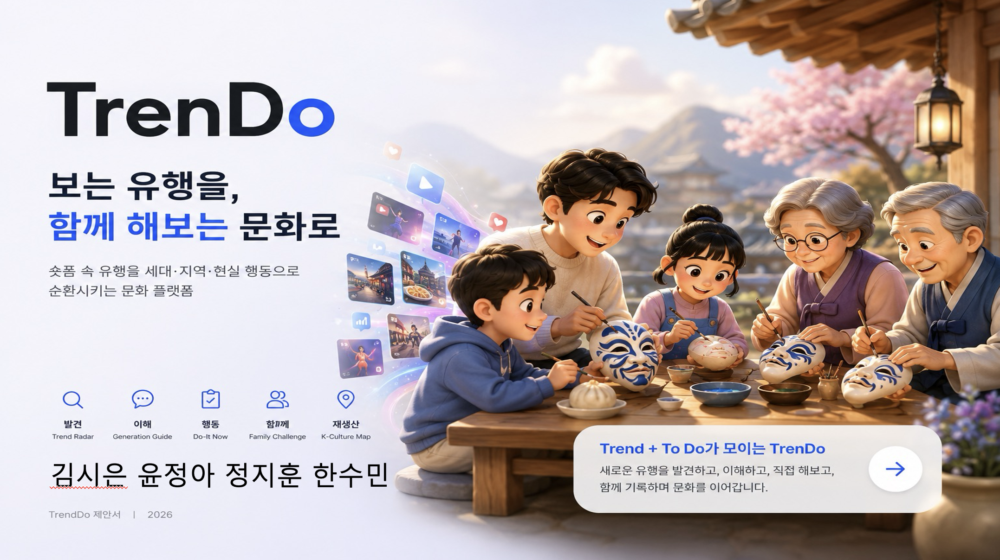

> **보는 유행을, 함께 해보는 문화로 바꾸는 플랫폼**

TrendDo는 숏폼과 알고리즘 안에서 빠르게 소비되고 사라지는 유행을 세대별 언어로 번역하고, 실제로 해볼 수 있는 ToDo 챌린지와 지역·전통문화 경험으로 전환하는 AI 문화 순환 플랫폼입니다.

단순히 “요즘 뭐가 유행인지” 보여주는 서비스가 아니라, 유행을 **이해 → 행동 → 지역 연결 → 문화 데이터화**까지 이어지게 만드는 것이 목표입니다.

## Team

<table>
  <tr>
    <td align="center" width="25%">
      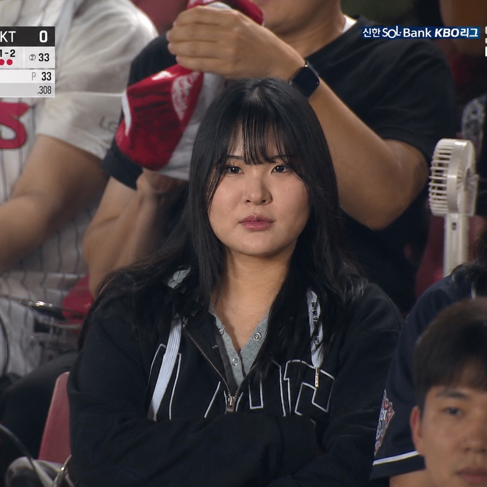
      <br />
      <a href="https://github.com/sheunn"><strong>김시은</strong></a>
    </td>
    <td align="center" width="25%">
      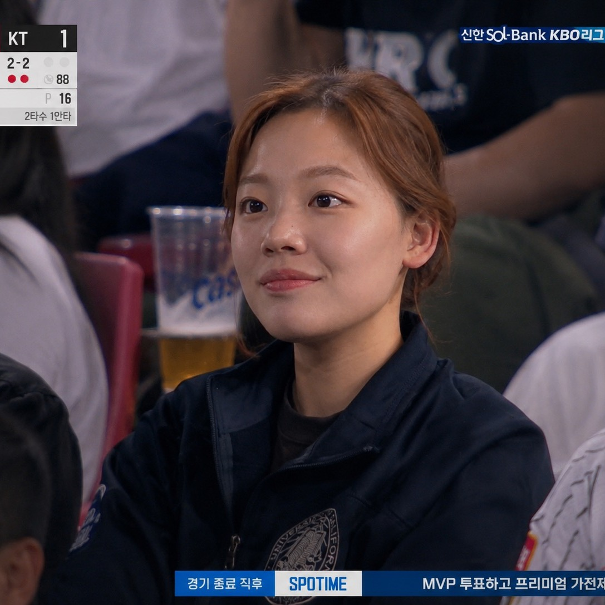
      <br />
      <a href="https://github.com/jjyoon012-git"><strong>윤정아</strong></a>
    </td>
    <td align="center" width="25%">
      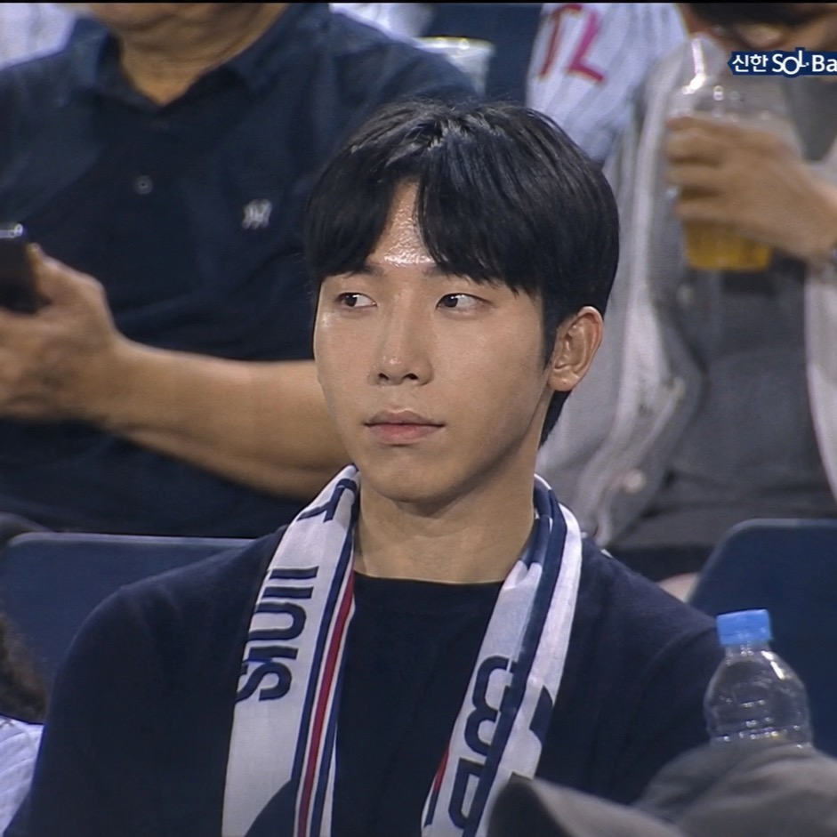
      <br />
      <a href="https://github.com/jeehun3020"><strong>정지훈</strong></a>
    </td>
    <td align="center" width="25%">
      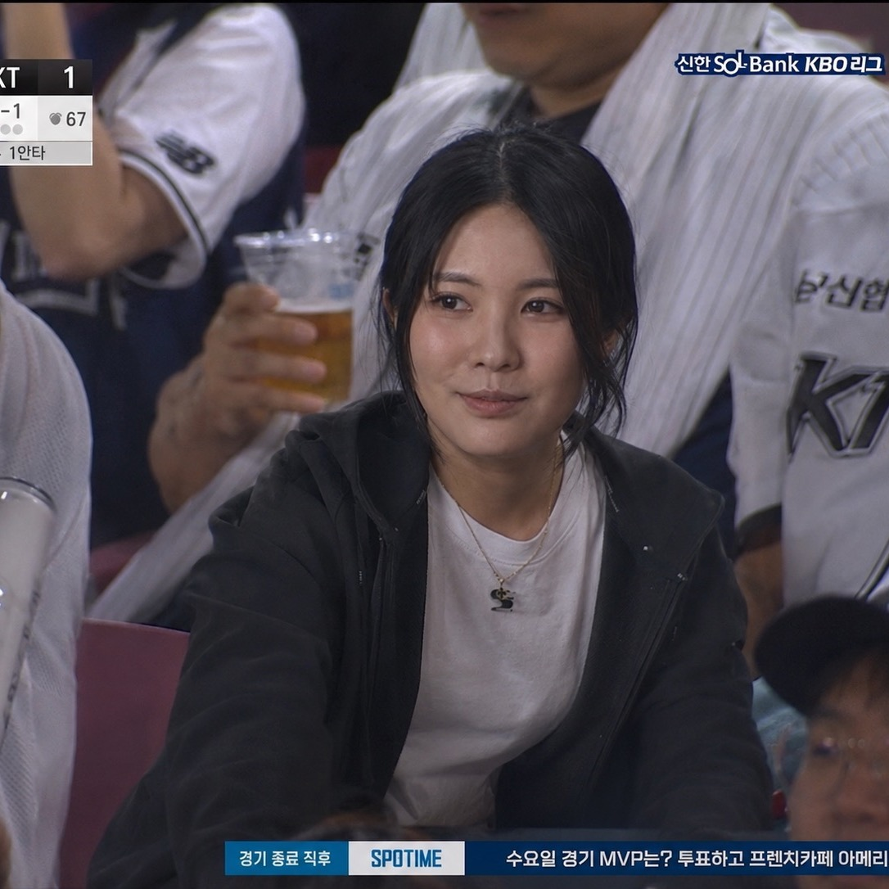
      <br />
      <a href="https://github.com/handoomin"><strong>한수민</strong></a>
    </td>
  </tr>
</table>

## 문제 의식

지금 대중문화는 콘텐츠가 부족한 것이 아니라, 너무 빠르게 소비되고 사라집니다.

- 세대에 따라 같은 유행을 이해하는 방식이 다릅니다.
- 숏폼 유행은 조회수는 높지만 실제 경험으로 이어지기 어렵습니다.
- 지역 축제, 전통시장, 공방, 전통문화는 현대 유행과 자연스럽게 연결되기 어렵습니다.
- 플랫폼은 좋아요와 조회수는 측정하지만, 문화가 실제 생활 속에 남았는지는 잘 보지 않습니다.

TrendDo는 이 문제를 다음 문장으로 정의합니다.

> 알고리즘은 사람을 더 오래 보게 만들지만, 문화는 더 깊게 경험되게 만들지 못한다.

## 해결 방향

TrendDo는 온라인 유행을 실제 문화 경험으로 바꾸는 네 단계 루프를 제공합니다.

| 단계 | 기능 | 설명 |
|---|---|---|
| 1. 발견 | Trend Radar | YouTube, Naver, seed 데이터에서 음식, 챌린지, 여행, 숏폼 문화, 미디어 유행을 수집합니다. |
| 2. 이해 | Generation Guide | 10대, 30·40대, 50·60대, 가족, 외국인에게 맞는 언어로 유행을 설명합니다. |
| 3. 행동 | Trend-Do Card | 유행을 준비물, 시간, 비용, 단계가 있는 ToDo 챌린지로 바꿉니다. |
| 4. 재생산 | K-Culture Map / Admin Ops | 지역 자산, 전통문화, 사용자 참여 데이터를 연결해 문화 순환을 시각화합니다. |

## 핵심 기능

### 사용자 앱

- **트렌드 피드**: 최신 유행 카드와 참여형 챌린지 추천
- **세대별 설명**: 같은 유행을 연령대별로 다르게 설명
- **Do-It Now**: 준비물, 예상 시간, 비용, 난이도, 단계별 체크리스트 제공
- **지역·전통문화 리믹스**: 유행을 전통시장, 공방, 축제, 지역 특산품과 연결
- **셋로그(Setlog)**: 사용자가 문화 경험을 한 줄 기록으로 남김
- **문화 순환 지도**: 지역별 참여, 연결, 문화 잔존 흐름을 시각화

## 사용자 앱 스크린샷

사용자 화면은 “유행을 발견하고, 내 세대·지역에 맞게 이해한 뒤, 실제 ToDo로 수행하고 기록하는 흐름”을 중심으로 구성되어 있습니다.

### 1. 홈 피드

오늘의 유행 카드, 인기 인증, 월간 Trend-Do 추천을 한 화면에서 탐색합니다.

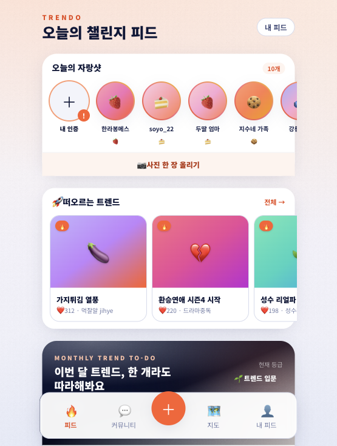

### 2. 챌린지 상세

유행 카드마다 세대·지역에 맞춘 설명, 난이도, 시간, 비용, 참여/저장/공유 액션을 제공합니다.

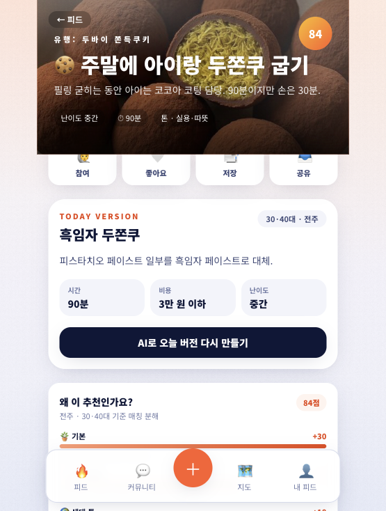

### 3. 지역 챌린지

사용자의 지역 맥락에 맞는 로컬 챌린지를 추천하고, 지역 자산과 연결된 참여 경험을 보여줍니다.

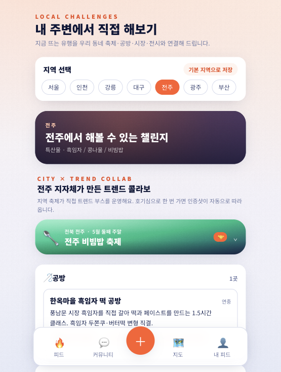

### 4. 문화 순환 지도

유행이 어떤 코드에서 시작해 어떻게 확산되고 잔존하는지 지도형 흐름으로 시각화합니다.

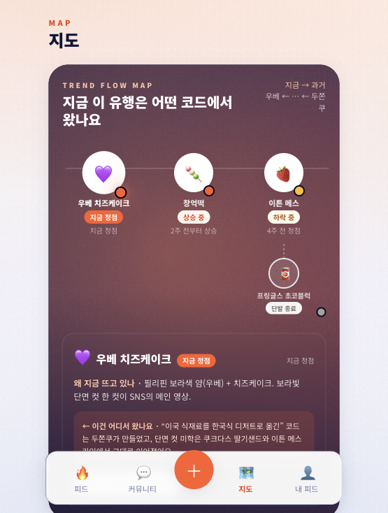

### 5. 커뮤니티 피드

다른 사용자의 인증과 따라 하기 흐름을 통해 유행이 실제 참여 문화로 재생산되는 모습을 보여줍니다.

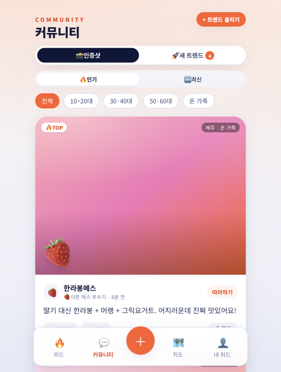

### 6. 내 피드

사용자의 저장, 참여, 선호 세대/지역 설정, 문화 기록을 한 곳에서 관리합니다.

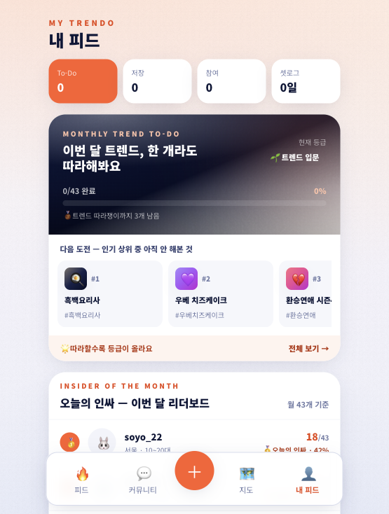

### 관리자 웹

TrendDo Admin은 단순 CMS가 아니라 **AI 문화 운영 관제실**입니다.

- **트렌드 수집 콘솔**: 실제 API 또는 demo seed 기반 트렌드 수집
- **Trend-Do Generator**: 선택한 유행 1~3개와 지역을 융합해 새 문화 경험 생성
- **지역 매칭 엔진**: 트렌드의 행동 유형과 지역 자산의 체험 가능성을 점수화
- **Safety Gate**: 초상권, 개인정보, 위험 행동, 문화 왜곡 가능성 검수
- **AI 카드 생성**: 세대별 ToDo, 문화 맥락, 안전 문구, XAI 근거를 포함한 카드 생성
- **Proposal Studio**: 지자체·기관 제안 메일 초안 생성
- **User Analytics**: 조회, 시작, 완료, 인증, 장소 클릭 등 참여 지표 분석
- **AI Ops Log**: 모든 LLM 실행의 입력, 출력, 모델명, 프롬프트 버전, 생성 시간을 기록

## 관리자 페이지 스크린샷

최근 구현된 관리자 화면은 “수집 → 선택 → 지역 융합 → 검수 → 제안” 흐름을 한 화면 안에서 시연할 수 있도록 구성되어 있습니다.

### 1. 트렌드 수집 콘솔

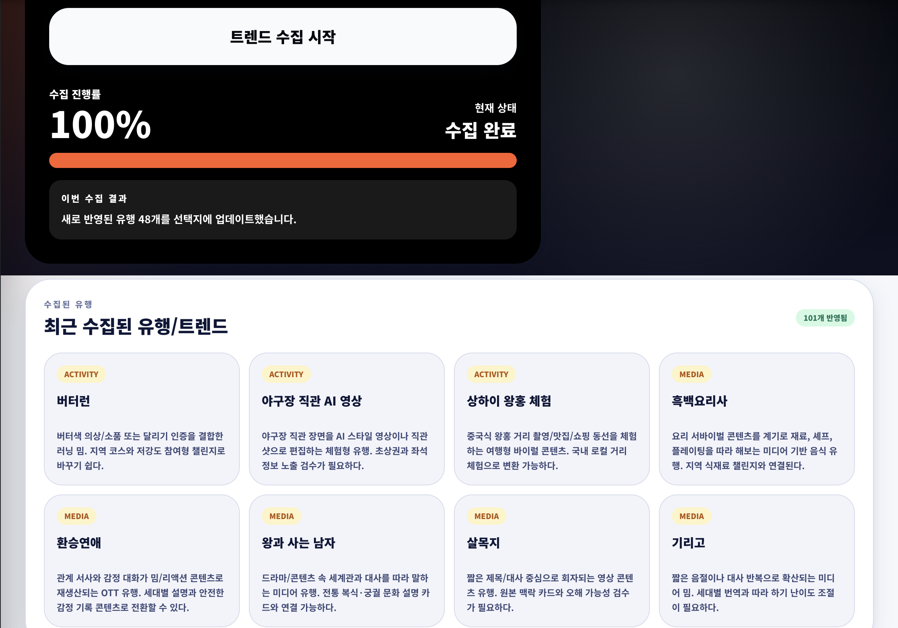

### 2. Trend-Do Generator

관리자는 수집된 유행과 기본 샘플 유행 중 1~3개를 선택하고, 지역을 선택해 문화 경험 생성을 시작합니다.

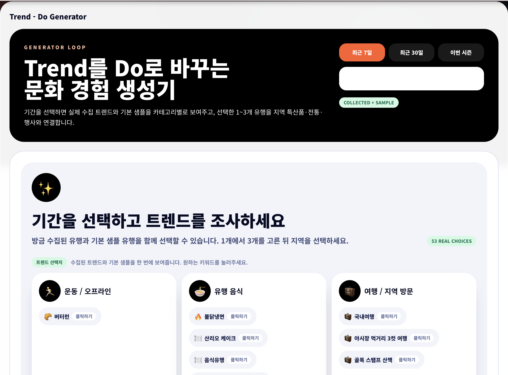

### 3. AI Experience Card

LLM은 단순히 `트렌드 + 지역`을 붙이지 않고, 지역 특산품과 유행의 행동 방식을 융합한 새 ToDo 카드를 생성합니다.

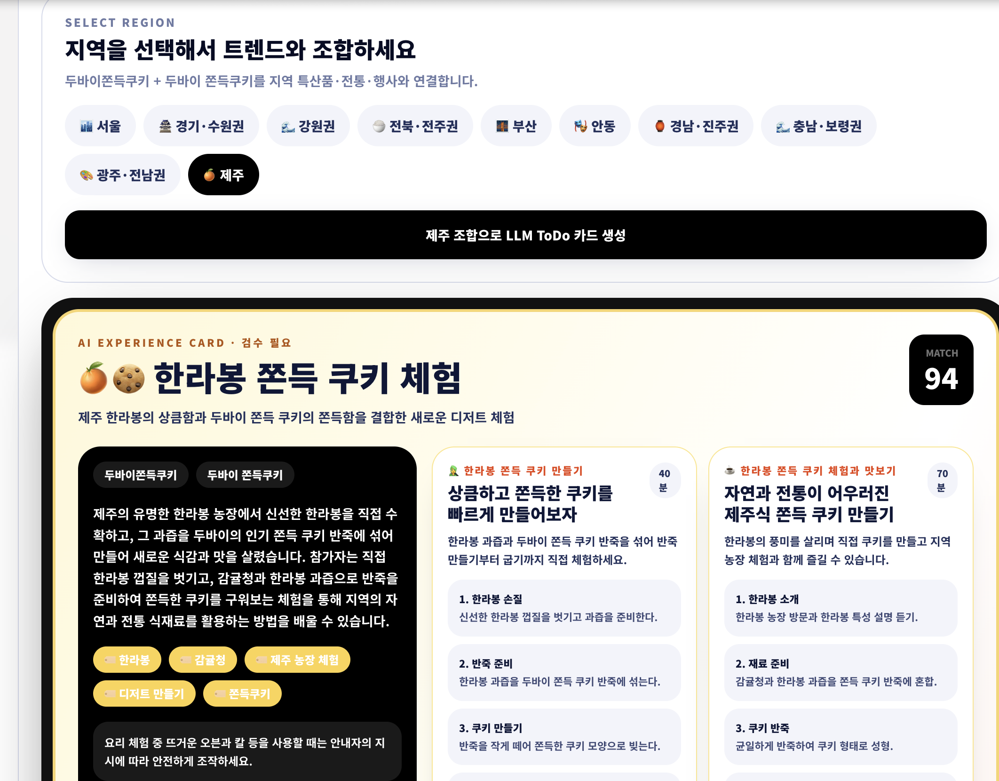

### 4. 트렌드 클러스터와 행동 전환 점수

수집된 유행은 클러스터 단위로 묶이고, Trend-to-Action Score를 통해 실제 행동형 챌린지로 바꿀 수 있는지 평가합니다.

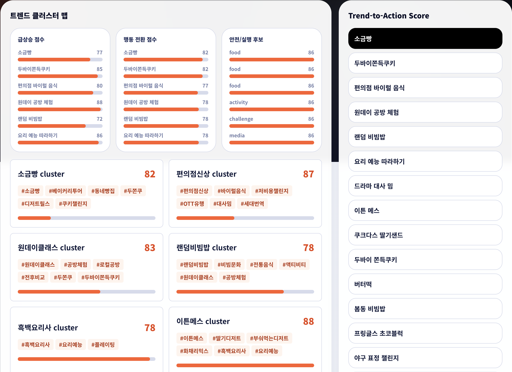

### 5. K-Culture Map과 XAI 지역 매칭

지역을 클릭하면 특산품, 전통문화, 진행 중인 축제, 문화 자산이 표시됩니다. Local Match는 행동·장소·소재·문화 맥락 기준으로 점수와 근거를 설명합니다.

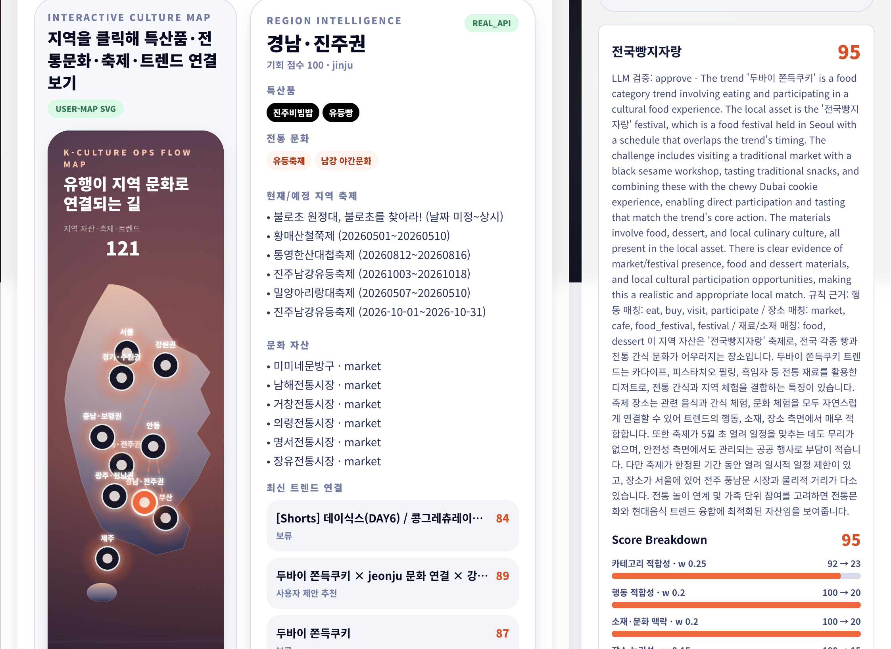

### 6. 지자체 제안 초안

승인 전 자동 발송 없이, 지역 기관에 보낼 협업 제안 메일 초안을 검수 상태로 생성합니다.

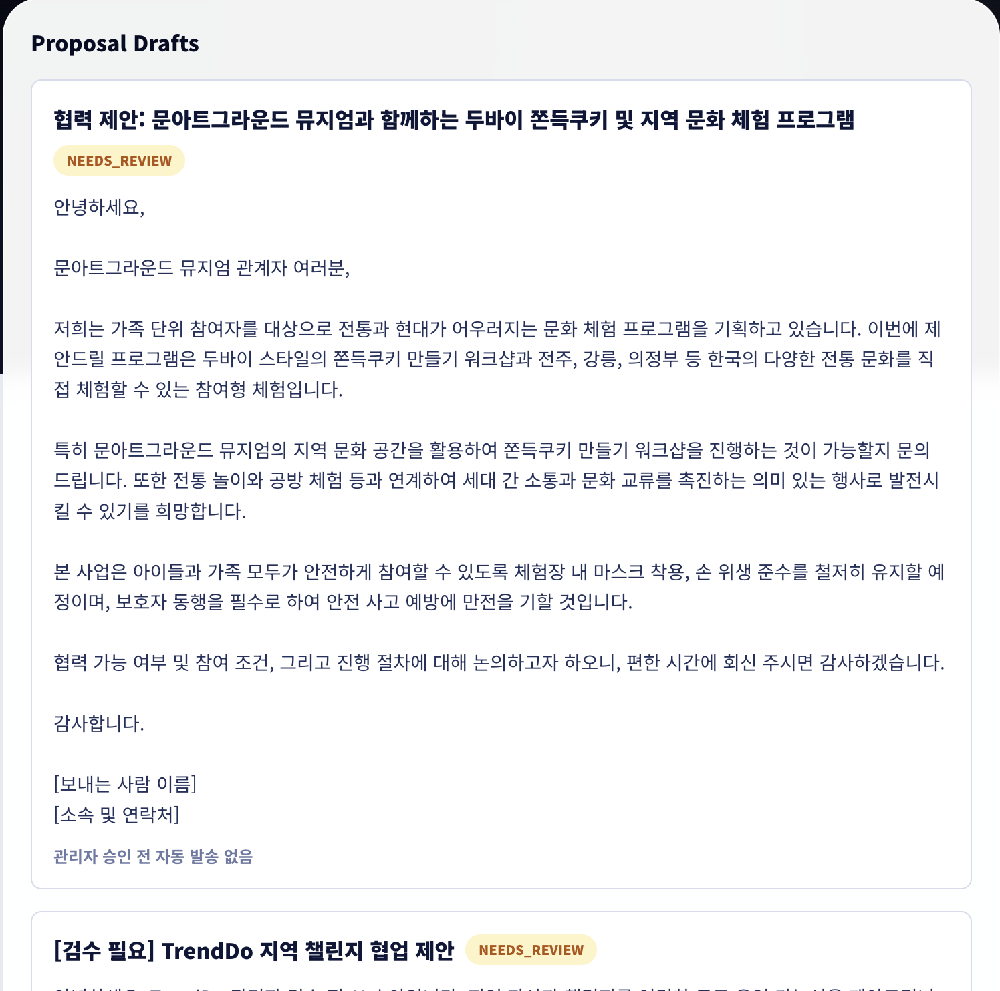

## AI 적용 방식

TrendDo는 LLM을 단순 문장 생성기가 아니라 운영 파이프라인 안에 배치합니다.

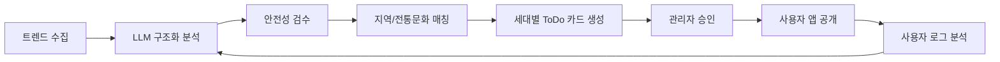
```mermaid
flowchart LR
  A["트렌드 수집"] --> B["LLM 구조화 분석"]
  B --> C["안전성 검수"]
  C --> D["지역/전통문화 매칭"]
  D --> E["세대별 ToDo 카드 생성"]
  E --> F["관리자 승인"]
  F --> G["사용자 앱 공개"]
  G --> H["사용자 로그 분석"]
  H --> B
```

### LLM이 하는 일

- 트렌드 맥락 요약
- 세대별 설명 생성
- 유행을 행동형 ToDo로 변환
- 지역 특산품·전통문화와 융합 아이디어 생성
- 안전성 검토
- 지자체 제안 메일 생성
- 사용자 로그 기반 개선안 생성

### LLM이 자동으로 하지 않는 일

- 사용자 화면 자동 공개
- 제안 메일 자동 발송
- 위험도 high 콘텐츠 승인
- 개인정보 원문 저장

모든 AI 생성 결과는 관리자 검수 상태로 시작합니다.

## 지역 융합 예시

TrendDo는 단순히 `트렌드 + 지역`을 붙이지 않고, 실제로 수행 가능한 새 경험으로 융합합니다.

| 입력 | 나쁜 예 | TrendDo 방식 |
|---|---|---|
| 두바이쫀득쿠키 + 강원 | 두바이쫀득쿠키 강원 체험 | 감자떡 쫀득 디저트 챌린지 |
| 포토 챌린지 + 전주 | 전주 포토 챌린지 | 한옥 골목 한 컷 리믹스 |
| 러닝크루 + 진주 | 진주 러닝크루 | 남강 유등 야간 무브 코스 |
| 꾸미기 유행 + 전통공예 | 전통공예 꾸미기 | 자개 패턴 키링 리믹스 |

## XAI 설계

AI 판단 결과는 Explanation Card로 표시됩니다.

- 최종 점수 또는 판단
- 상위 기여 요인
- 감점 요인
- 사용 데이터 출처
- 모델명
- 프롬프트 버전
- 생성 시간
- 관리자 검수 상태

지역 매칭 점수는 다음 요소를 사용합니다.

| 항목 | 설명 |
|---|---|
| 카테고리 적합성 | 음식은 시장/먹거리/카페/축제처럼 기본 용도부터 맞는지 검토 |
| 행동 적합성 | 먹기, 만들기, 찍기, 걷기, 보기 등 유행의 핵심 행동과 지역 자산 체험 비교 |
| 소재·문화 맥락 | 재료, 전통 요소, 문화 키워드가 겹치는지 확인 |
| 장소 논리성 | 실제 수행 장소로 자연스러운지 판단 |
| 일정/운영성 | 진행 중 행사 또는 상시 운영 여부 |
| 안전/검수 부담 | 초상권, 개인정보, 위험 행동 가능성 감점 |

## 데이터 출처 정책

TrendDo는 가짜 수치를 실제 데이터처럼 보여주지 않습니다.

| 라벨 | 의미 |
|---|---|
| `real_api` | 실제 API 또는 OpenAI 호출에 성공한 데이터 |
| `demo_seed` | API 키가 없을 때 사용하는 데모용 seed 데이터 |
| `mock_data` | 실제 연동 전 구조 검증용 임시 데이터 |
| `derived` | 수집 데이터와 AI 분석을 바탕으로 생성된 파생 데이터 |

## 기술 스택

| 영역 | 기술 |
|---|---|
| Frontend | React, TypeScript, Vite, Tailwind CSS |
| Admin UI | React, Recharts 스타일 차트, SVG 기반 지도/시각화 |
| Backend | Node.js, Express, TypeScript |
| AI | OpenAI Responses API, Structured Output, Embedding |
| Validation | Zod schema |
| Data Store | 로컬 JSON store, SQLite fallback 지향 구조 |
| External APIs | YouTube Data API, Naver DataLab/Search, 공공데이터 포털 확장 구조 |

## 프로젝트 구조

```text
TrenDo/
├── app/
│   ├── src/
│   │   ├── pages/
│   │   │   ├── HomeFeed.tsx
│   │   │   ├── ChallengeDetail.tsx
│   │   │   ├── CultureMapPage.tsx
│   │   │   ├── Community.tsx
│   │   │   ├── Setlog.tsx
│   │   │   └── Admin.tsx
│   │   ├── components/
│   │   ├── data/
│   │   └── lib/
│   └── package.json
├── server/
│   ├── src/
│   │   ├── admin/
│   │   │   ├── aiClient.ts
│   │   │   ├── providers.ts
│   │   │   ├── routes.ts
│   │   │   ├── schemas.ts
│   │   │   ├── scoring.ts
│   │   │   └── seed.ts
│   │   └── index.ts
│   └── package.json
├── .env.example
└── README.md
```

## 실행 방법

### 1. 서버 실행

```bash
cd server
npm install
cp ../.env.example .env
npm run dev
```

기본 서버 주소:

```text
http://localhost:8787
```

### 2. 프론트 실행

```bash
cd app
npm install
npm run dev
```

기본 앱 주소:

```text
http://localhost:5174
```

주요 화면:

| 경로 | 설명 |
|---|---|
| `/` | 사용자 홈 피드 |
| `/admin` | 관리자 AI 문화 운영 관제실 |
| `/map` | 문화 순환 지도 |
| `/community` | 커뮤니티 피드 |
| `/setlog` | 셋로그 |
| `/saved` | 저장한 챌린지 |
| `/me` | 내 문화 로그 |

## 환경변수

실제 API를 사용하려면 `.env`에 키를 넣습니다. `.env`는 git에 올리지 않습니다.

```env
OPENAI_API_KEY=
OPENAI_MODEL=gpt-4.1-mini
OPENAI_EMBEDDING_MODEL=text-embedding-3-small

YOUTUBE_API_KEY=
NAVER_CLIENT_ID=
NAVER_CLIENT_SECRET=

DATA_GO_KR_API_KEY=
TOUR_API_KEY=
CULTURE_API_KEY=
CULTURE_API_URL=

TREND_RSS_URLS=
TREND_CSV_URL=
INSTAGRAM_ACCESS_TOKEN=
INSTAGRAM_TREND_CSV_URL=

DATABASE_URL=file:./data/trendo-admin.sqlite
```

## 주요 관리자 API

| Method | Route | 설명 |
|---|---|---|
| `GET` | `/api/admin/state` | 관리자 전체 상태 조회 |
| `POST` | `/api/admin/collect/trends` | 트렌드 수집 |
| `POST` | `/api/admin/collect/local-assets` | 지역 자산 수집 |
| `POST` | `/api/admin/ai/generate-experience-card` | Trend-Do 경험 카드 생성 |
| `POST` | `/api/admin/ai/generate-challenge` | 챌린지 생성 |
| `POST` | `/api/admin/ai/review-safety` | 안전성 검수 |
| `POST` | `/api/admin/ai/match-local-assets` | 지역 자산 매칭 |
| `POST` | `/api/admin/ai/generate-proposal` | 제안 메일 초안 생성 |
| `GET` | `/api/admin/analytics/summary` | 사용자 로그 분석 |
| `POST` | `/api/admin/reports/generate` | 임팩트 리포트 생성 |
| `GET` | `/api/admin/ai-runs` | AI 실행 로그 |

## Structured Output 검증

LLM 출력은 `server/src/admin/schemas.ts`의 Zod schema로 검증합니다.

- `TrendContextSchema`
- `GenerationTranslationSchema`
- `ChallengeGenerationSchema`
- `SafetyReviewSchema`
- `LocalMatchExplanationSchema`
- `LocalMatchVerificationSchema`
- `ProposalEmailSchema`
- `AnalyticsDiagnosisSchema`
- `ImpactReportSchema`
- `TrendCardPackageSchema`
- `ExperienceCardSchema`

검증 실패 또는 API 키 부재 시 fallback 결과를 저장하고, `AiRun.status=fallback`, `provenance_label=demo_seed`로 기록합니다.

## 테스트

```bash
cd server
npm test
```

테스트 범위:

- Local Match Score 계산
- Trend-to-Action Score 계산
- Analytics metric의 0 나누기 방지
- LLM JSON schema validation 실패 처리

## 시연 시나리오

1. 사용자 홈에서 유행 카드를 확인합니다.
2. 세대별 설명을 바꿔 같은 유행이 다르게 번역되는 것을 보여줍니다.
3. 관리자 `/admin`으로 이동합니다.
4. 트렌드 수집 버튼을 눌러 실제 API 또는 demo seed 기반 유행을 수집합니다.
5. Trend-Do Generator에서 유행 1~3개와 지역을 선택합니다.
6. LLM으로 지역 융합 ToDo 카드를 생성합니다.
7. Safety Gate와 XAI 점수 근거를 확인합니다.
8. 관리자 승인 후 사용자 앱에 제안할 수 있음을 보여줍니다.

## 팀이 강조하는 가치

TrendDo는 유행을 더 많이 소비하게 만드는 서비스가 아닙니다.

TrendDo는 유행을 세대, 지역, 전통문화, 실제 행동으로 다시 연결해 **문화가 생활 속에서 지속되도록 만드는 서비스**입니다.
